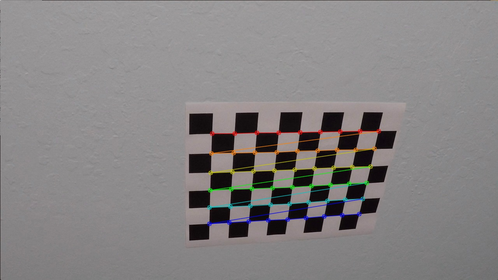
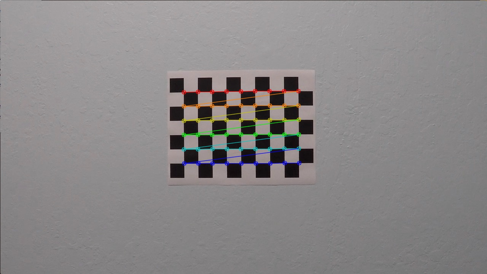

## Writeup

**Advanced Lane Finding Project**

The goals / steps of this project are the following:

* Compute the camera calibration matrix and distortion coefficients given a set of chessboard images.
* Apply a distortion correction to raw images.
* Use color transforms, gradients, etc., to create a thresholded binary image.
* Apply a perspective transform to rectify binary image ("birds-eye view").
* Detect lane pixels and fit to find the lane boundary.
* Determine the curvature of the lane and vehicle position with respect to center.
* Warp the detected lane boundaries back onto the original image.
* Output visual display of the lane boundaries and numerical estimation of lane curvature and vehicle position.

---

### Camera Calibration

#### 1. Briefly state how you computed the camera matrix and distortion coefficients. Provide an example of a distortion corrected calibration image.

The code for this step is contained in the main function and in the *get_points_for_calibration()* function:

```python
#Creat a directory 'CameraCalibration' under 'output_images'
    output_dir = "CameraCalibration"
    if not os.path.isdir(output_dir):
        os.makedirs(output_dir)
    ### Camera calibration ###
    if os.path.exists(calibration_file):
        print("Read in the calibration data\n")
        wide_dist_pickle = pickle.load(open(calibration_file, "rb"))
        mtx = wide_dist_pickle["mtx"]
        dist = wide_dist_pickle["dist"]
    else:
        print("Calibrate camera...")
        objpoints, imgpoints = CameraCalibration(9, 6)
        img = cv2.imread('./test_images/test1.jpg')
        ret, mtx, dist, rvecs, tvecs = cv2.calibrateCamera(objpoints, imgpoints, img.shape[1::-1], None, None)

        print("Save the camera calibration result for later use\n")
        wide_dist_pickle = {}
        wide_dist_pickle["mtx"] = mtx
        wide_dist_pickle["dist"] = dist
        pickle.dump(wide_dist_pickle, open(calibration_file, "wb"))
```


The chessboard pattern used for calibration contains 9 and 6 corners in the horizontal and vertical directions, respectively (as shown above). First, I start by preparing "object points", which will be the (x, y, z) coordinates of the chessboard corners in the world. Here I am assuming the chessboard is fixed on the (x, y) plane at z=0, such that the object points are the same for each calibration image. Those object points are stored in the list `objp`:

```python
def CameraCalibration(nx, ny):
    # Prepare object points
    objp = np.zeros((ny*nx,3), np.float32)
    objp[:,:2] = np.mgrid[0:nx, 0:ny].T.reshape(-1,2)
```

For each chessboard image, taken from different angles with the same camera, we retrieve the (x,y) pixel position of the chessboard corners using the OpenCV function `findChessboardCorners`. Those points are then appended to the `imgpoints` list, whereas the `objp` are appended to the `objpoints` list for each succcessful chessboard detection:

```python
# Find chessboard corners (for an 9x6 board)
        ret, corners = cv2.findChessboardCorners(img, (nx,ny), None)

        if (ret == True):
            objpoints.append(objp)
            imgpoints.append(corners)
```

I then used the output `objpoints` and `imgpoints` to compute the camera calibration and distortion coefficients using the `cv2.calibrateCamera()` function:

```python
retval, mtx, dist_coeff, rvecs, tvecs = cv2.calibrateCamera(objpoints, imgpoints, img.shape[1::-1], None, None)
```

Below, you can see the detected corners drawn on each chessboard image:

||
------------ | ------------- | ------------
||
||
||
||
|

In order to do not compute camera matrix and distortion coefficients every time, I saved them in a pickle file to reuse them every time I run my pipeline for the project videos.

### Pipeline (single images)

The pipeline created for this project processes images in the following steps:

- **Step 1**: Apply distortion correction using a computed camera calibration matrix and distortion coefficients.
- **Step 2**: Apply a perspective transformation to warp the image to a birds eye view perspective of the lane lines.
- **Step 3**: Apply color and gradient thresholds to create a binary image which isolates the pixels representing lane lines.
- **Step 4**: Detect the lane line pixels and fit a polynomial for the left and right lane boundaries.
- **Step 5**: Compute radius of curvature of the lane and vehicle position from the lane center.
- **Step 6**: Unwarp the detected lane boundaries back onto the original image
- **Step 7**: Output data information of the lane onto the image with step 3 and 4 for debugging.

You can find the steps in the function called `ProcessImage`

#### 1. Provide an example of a distortion-corrected image.

Images from the camera have been undistorted using the camera calibration matrix and distortion coefficients computed previously. I applied this distortion correction to the test images using the `cv2.undistort()` function:

```python 
    def processImg(self, img, output_dir = "", file_name = "", save_steps = False):

        #Step1. Distortion correction ###
        undistorted = cv2.undistort(img, mtx, dist, None, mtx)
```

An example of an image before and after the distortion correction step is shown below:


#### 2. Describe how (and identify where in your code) you performed a perspective transform and provide an example of a transformed image.

The code for my perspective transform includes a function called `perspactive_transform()`.  The `perspactive_transform()` function takes as inputs the image to process (`img`). The source (`src`) and destination (`dst_coeff`) points are defined inside that function.

```python
def perspectiveTransform(img):
    img_size = (img.shape[0], img.shape[1])
    # Define src and dst points
    x_center = img_size[1]/2
    x_offset=120
    src = np.float32([(x_offset,img_size[0]), (x_center-54, 450), (x_center+54, 450), (img_size[1]-x_offset,img_size[0])])
    dst = np.float32([(x_offset,img_size[1]), (x_offset,0), (img_size[0]-x_offset, 0), (img_size[0]-x_offset,img_size[1])])
    # Apply transform
    M = cv2.getPerspectiveTransform(src, dst)
    Minv = cv2.getPerspectiveTransform(dst, src)
    return (cv2.warpPerspective(img, M, (img_size[0], img_size[1]), flags=cv2.INTER_LINEAR), Minv)
```

Using the OpenCV `getPerspectiveTransform` and `warpPerspective` I obtain the following result:


#### 3. Describe how (and identify where in your code) you used color transforms, gradients or other methods to create a thresholded binary image.  Provide an example of a binary image result.

I used a combination of color and gradient thresholds to generate a binary image Here's an example of my output for this step:


#### 4. Describe how (and identify where in your code) you identified lane-line pixels and fit their positions with a polynomial?

The lane detection was performed using histogram method with sliding window, but also using history along the video frames, in the `slidingWindowsPolyfit` function.

##### 4.1 - Historgram and sliding windows

The first step is to compute a histogram of the lower half image. It gives me the 2 pics where the lanes are located.

After that, the sliding window method is used to extract the lane pixels from the bottom to the top of the image. It's done by dividing the image into 9 horizontal strips. Each strip (starting from the bottom) is processed one after the other, where a fixed window is centered around the x position of the non zero pixels. Those pixels are appended to the lists `left_lane_inds` and `right_lane_inds`.

These lists are then used with `np.polyfit` to compute a second order polynomial that fits the points:

```python
    # Concatenate the arrays of indices
    left_lane_inds = np.concatenate(left_lane_inds)
    right_lane_inds = np.concatenate(right_lane_inds)

    # Extract left and right line pixel positions
    leftx = nonzerox[left_lane_inds]
    rightx = nonzerox[right_lane_inds]
    lefty = nonzeroy[left_lane_inds]
    righty = nonzeroy[right_lane_inds]

    # Fit a second order polynomial to each
    left_fit = np.polyfit(lefty, leftx, 2)
    right_fit = np.polyfit(righty, rightx, 2)
```

##### 4.2 - History

This method is used to speed up processing with videos once a lane has already been detected before. Previously detected lanes are used to define regions of interest where the lanes are likely to be in. The algorithm uses the base points of the previous lanes to find all non-zero pixels around it in the current image. No histogram is computed in this case, and the windows searching is done once on the entire frame.

This is implemented in the `slidingWindowsPolyfit` function.

#### 5. Describe how (and identify where in your code) you calculated the radius of curvature of the lane and the position of the vehicle with respect to center.

The radius of curvature and the position of the vehicle are computed in the `measure_curvature` function. The pixel values of the lane are converted into meters using the following values:

```python
    # Define conversions in x and y from pixels space to meters
    ym_per_pix = 30/720 # meters per pixel in y dimension
    xm_per_pix = 3.7/700 # meters per pixel in x dimension
```

These values are used to compute the polynomial coefficients in meters in order to compute the radius of curvature with [this formula](https://www.intmath.com/applications-differentiation/8-radius-curvature.php), and the vehicle position assuming that the camera is centered in the car:
    left_fit_converted = np.polyfit(lefty*ym_per_pix, leftx*xm_per_pix, 2)
    right_fit_converted = np.polyfit(righty*ym_per_pix, rightx*xm_per_pix, 2)

    # Choose point to compute curvature just in front of the car
    yvalue = img.shape[0]

    # Compute curvature radius
    left_curv_radius = ((1 + (2*left_fit_converted[0]*yvalue + left_fit_converted[1])**2)**1.5) / (2*np.absolute(left_fit_converted[0]))
    right_curv_radius = ((1 + (2*right_fit_converted[0]*yvalue + right_fit_converted[1])**2)**1.5) / (2*np.absolute(right_fit_converted[0]))

    # Compute distance in meters of vehicle center from the line
    car_center = img.shape[1]/2  # we assume the camera is centered in the car
    lane_center = ((left_fit[0]*yvalue**2 + left_fit[1]*yvalue + left_fit[2]) + (right_fit[0]*yvalue**2 + right_fit[1]*yvalue + right_fit[2])) / 2
    center_dist = (lane_center - car_center) * xm_per_pix
```

#### 6. Provide an example image of your result plotted back down onto the road such that the lane area is identified clearly.

As a reminder, the complete pipeline is defined in the `ProcessImg` function.

The detected lane and some information (radius of curvature, vehicle position, pipeline steps) are then display on top of the original image using the `drawLane` and `drawData` function.

An example image that was processed by the pipeline is shown below: 


---

### Pipeline (video)

#### 1. Provide a link to your final video output.  Your pipeline should perform reasonably well on the entire project video (wobbly lines are ok but no catastrophic failures that would cause the car to drive off the road!).

Here's a [Project Video](https://github.com/snehalmparmar/CarND-Advanced-Lane-Lines/blob/master/test_videos/project_video.mp4)


---

### Discussion

#### 1. Briefly discuss any problems / issues you faced in your implementation of this project.  Where will your pipeline likely fail?  What could you do to make it more robust?

The main issues encountered during this project were due to the lighting conditions, shadows, contrast, and discoloration of the lines along the vehicle trip. The threshold parameters for color and gradient have been tuned many many times to find the ones that will make the detection good enough on the project video. Furthermore, a relatively basic history tracking has been implemented to smooth the lane detection and video output. It helps but was not as good as expected. 

Hence, a few possible approaches for improving my pipeline and making it more robust could be the followings:

- Review more color spaces (such as [Lab](https://en.wikipedia.org/wiki/Lab_color_space)) to better isolate lines
- Perform a dynamic color and gradient thresholding to be more robust accross differents conditions (light, shadow, ...)
